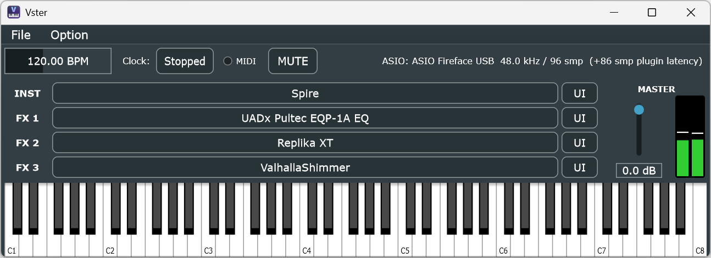

# Vster

A minimal host that launches VST3 plugins like standalone applications (Windows x64).
Play a software instrument instantly, without starting a DAW.

## Features

- Fixed serial chain: **1 VST3 instrument + 3 insert VST3 effects** (Inst → FX1 → FX2 → FX3 → Master)
- **ASIO** and WASAPI output
- **Host BPM** — tempo-synced plugins (delays, LFOs, arpeggiators, ...) follow the host
  play head, with a clock Running/Stopped toggle (starts stopped; Running restarts from bar 1)
- On-screen keyboard plus **hardware MIDI input** — every MIDI device is enabled
  automatically on launch and on hot-plug, with a MIDI input lamp in the top bar
- **Session save/load** (`.vster`) from the File menu: New, Load..., Save (overwrites the
  current session file, `Ctrl+S`) and Save As....
  Saved: slot configuration, full plugin states, BPM, master volume.
  If a plugin is missing on load, its saved state is preserved and written back on the next save;
  reloading the same plugin restores it automatically
- Master volume / MUTE (click-free ramp) and a stereo peak meter
- Crash insurance: autosave before each plugin load and on exit, with recovery on restart
- **Plugin Manager** (Option menu) with three scan modes — **Full Scan**, **Scan Modified**
  (only files that are new or changed since the last scan) and **Scan by Name**
  (case-insensitive filename match) — plus a blacklist view where a blacklisted plugin
  can be un-blacklisted. A plugin that crashes or hangs while being scanned is blacklisted
  automatically (dead-man's-pedal), and during a long scan the plugin list is saved every
  few plugins, so an interrupted scan keeps its progress

No sequencer, a single track only. MIDI is routed to the instrument slot only
(vocoder/arpeggiator-style *effect* plugins will stay silent).



## Download

Prebuilt binaries for Windows x64 (with ASIO support) are available on the
[Releases page](https://github.com/aike/Vster/releases). No installation is needed.

1. Open https://github.com/aike/Vster/releases and pick the latest release
   (releases marked *Pre-release* are test builds).
2. Under **Assets**, download `Vster-<version>-win64.zip`
   (not the "Source code" archives).
3. Unzip it to any folder, e.g. `C:\Tools\Vster\`.
4. Run `Vster.exe`.
   - If Windows SmartScreen shows "Windows protected your PC", click
     **More info** → **Run anyway** (the binary is not code-signed).
5. Open **Option > Plugin Manager...** and click **Full Scan** to find the VST3 plugins
   installed in the standard folder (`C:\Program Files\Common Files\VST3`). Plugins that
   crash or hang while being scanned are skipped automatically.
6. Choose your audio device (ASIO or WASAPI) with **Option > Audio Settings...**.

To update, download the new zip and replace `Vster.exe`. Settings and the plugin
list are stored separately in `%APPDATA%\Vster`, so they are kept.

Requirements: Windows 10/11 64-bit, 64-bit VST3 plugins.

## Building

Requirements: Visual Studio 2022 (with the "Desktop development with C++" workload),
CMake 3.22+, git. Run the commands below from a *Developer PowerShell for VS 2022*
(or any shell where `cmake` and `git` are on the PATH).

### 1. JUCE

Vster needs the JUCE source tree. CMake looks for it via `JUCE_DIR`
(default: `external/JUCE`, the git submodule). Either:

**a) Use the submodule (default)**

```
git clone --recursive https://github.com/aike/Vster.git
cd Vster
```

If you already cloned without `--recursive`, fetch JUCE afterwards:

```
git submodule update --init
```

Check: `external/JUCE/CMakeLists.txt` must exist.

**b) Use a JUCE checkout elsewhere**

```
git clone https://github.com/juce-framework/JUCE.git D:/lib/JUCE
```

and pass `-DJUCE_DIR=D:/lib/JUCE` when configuring (step 3).
`JUCE_DIR` must be the folder that directly contains JUCE's `CMakeLists.txt`
(i.e. `D:/lib/JUCE/CMakeLists.txt` exists).

### 2. ASIO SDK (optional, recommended)

Steinberg's license **forbids redistributing the ASIO SDK**, so it is not part of this
repository and must never be committed to it. To build with ASIO support:

1. Download the ASIO SDK from https://www.steinberg.net/developers/
   (free, license agreement required)
2. Unzip it. The zip contains a versioned top-level folder
   (e.g. `asiosdk_2.3.3_2019-06-14`); rename/move it so that you get:

   ```
   D:/lib/ASIOSDK/
       asio/
       common/
           iasiodrv.h      <- this file must exist
       driver/
       host/
       ...
   ```

3. Pass `-DASIOSDK_DIR=D:/lib/ASIOSDK` when configuring (step 3).
   `ASIOSDK_DIR` is the folder that contains `common/`, **not** `common/` itself.

   Alternatively, put the SDK at `sdk/asiosdk/` inside this repository
   (`sdk/asiosdk/common/iasiodrv.h`); then `ASIOSDK_DIR` can be omitted.
   `sdk/` is git-ignored.

Only the SDK headers are used. If the SDK is not found, CMake prints a warning and
builds a WASAPI-only binary (you can also disable ASIO explicitly with
`-DVSTER_ENABLE_ASIO=OFF`).
When ASIO is enabled, the configure output shows
`-- ASIO SDK found at D:/lib/ASIOSDK — ASIO enabled`.

### 3. Configure and build

Example with JUCE as submodule and the ASIO SDK in `D:/lib/ASIOSDK`:

```
cmake -B build -G "Visual Studio 17 2022" -A x64 -DASIOSDK_DIR=D:/lib/ASIOSDK
cmake --build build --config Release
```

Example with both libraries outside the repository:

```
cmake -B build -G "Visual Studio 17 2022" -A x64 -DJUCE_DIR=D:/lib/JUCE -DASIOSDK_DIR=D:/lib/ASIOSDK
cmake --build build --config Release
```

WASAPI only (no ASIO SDK):

```
cmake -B build -G "Visual Studio 17 2022" -A x64 -DVSTER_ENABLE_ASIO=OFF
cmake --build build --config Release
```

Notes:

- Use forward slashes (`D:/lib/JUCE`) or quote the path (`"-DJUCE_DIR=D:\lib\JUCE"`).
  Paths containing spaces must be quoted.
- The paths are cached in `build/CMakeCache.txt`. If you change them, or a previous
  configure failed, delete the `build` folder and configure again.
- You can also open `build/Vster.sln` in Visual Studio and build from there.

Binary: `build/Vster_artefacts/Release/Vster.exe`

## For committers

### Release procedure

Releases are built and published by GitHub Actions
([.github/workflows/release.yml](.github/workflows/release.yml)) when a version tag
`v*` is pushed. The workflow builds `Vster.exe` with ASIO support (the ASIO SDK is
downloaded from Steinberg during the build, never committed), and attaches
`Vster-<tag>-win64.zip` (`Vster.exe`, `LICENSE`, `README.md`) to a new GitHub Release
with auto-generated release notes.

1. Bump the version in `CMakeLists.txt` (the tag must match it, or the workflow fails):

   ```cmake
   project(Vster VERSION 0.2.0 LANGUAGES C CXX)
   ```

2. Commit and push to `main`:

   ```
   git add CMakeLists.txt
   git commit -m "Release 0.2.0"
   git push origin main
   ```

3. Tag the commit and push the tag:

   ```
   git tag v0.2.0
   git push origin v0.2.0
   ```

   A tag with a suffix such as `v0.2.0-rc1` is published as a **pre-release**.

4. Watch the run in the repository's **Actions** tab. When it finishes, the release
   appears under **Releases**. Edit the generated notes there if needed.

If the workflow fails, fix the problem, then delete and re-push the tag:

```
git tag -d v0.2.0
git push origin :refs/tags/v0.2.0
# (also delete the GitHub Release if one was created)
git tag v0.2.0
git push origin v0.2.0
```

## Known limitations

- **64-bit VST3 only.** 32-bit plugins and VST2 (`.dll`) cannot be loaded.
- Plugins run in-process: **a crashing plugin takes Vster down with it.**
  Autosave/recovery limits the damage; a plugin that crashes a scan is blacklisted
  automatically on the next run.
- No plugin delay compensation. Latency from look-ahead plugins simply adds up
  (the total is shown in the status readout).
- ASIO drivers are usually exclusive — the device may fail to open while a DAW is using it.
- Some VST3 editors misbehave on HiDPI setups.

## License

Vster is free software, released under the **GNU Affero General Public License v3.0**
(see [LICENSE](LICENSE)). AGPLv3 was chosen because it is the license under which the
dependencies may be used at no cost, and the combination stays compliant:

- **JUCE** (git submodule at `external/JUCE`) is used under its **AGPLv3** option.
  Vster as a whole is therefore distributed under AGPLv3.
- **VST3 hosting** uses the VST3 interface headers bundled with JUCE, which Steinberg
  makes available under **GPLv3**. GPLv3 code may be combined with AGPLv3 code
  (see GPLv3 §13 / AGPLv3 §13); the combined work is distributed under AGPLv3.
  The separate proprietary Steinberg VST 3 SDK license is **not** used.
- The **ASIO SDK** is **not included** in this repository and is never redistributed
  in source form (its license forbids that). Users who want ASIO support download it
  from Steinberg themselves and accept Steinberg's license. Distributing *compiled*
  binaries built against it is permitted by the ASIO SDK licensing terms with the
  trademark attribution below.

If you distribute modified versions, the AGPLv3 requires you to provide the complete
corresponding source code.

### Trademark notices

VST is a trademark of Steinberg Media Technologies GmbH, registered in Europe and
other countries.
ASIO is a trademark and software of Steinberg Media Technologies GmbH.
